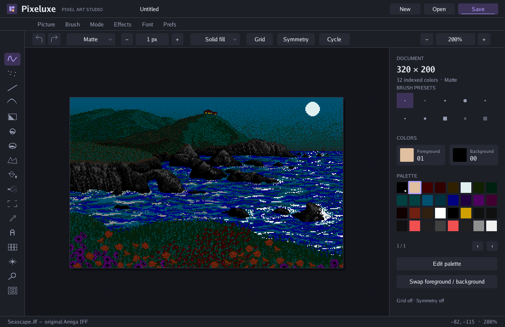

# Pixeluxe

Pixeluxe is a pure Go pixel art editor inspired by **Deluxe Paint II on Amiga**, with a modern desktop interface. It preserves the Picture / Brush / Mode / Effects / Font / Prefs menus, drawing tools, and original pictures and bitmap fonts from the supplied disk. Editing operates on indexed pixels and their palette; the Amiga program is neither executed nor emulated.



## Getting started

Requirements: **Go 1.25 or later**. The window uses **Ebitengine 2.10.2**; desktop builds use `CGO_ENABLED=0` and do not require a C compiler. The first build downloads the Go dependencies. Example pictures and fonts are embedded in the executable.

```sh
CGO_ENABLED=0 go run .
```

Build the executable and open the original example:

```sh
make build
./bin/pixeluxe -demo
```

On macOS, build and open the application bundle:

```sh
make app
open bin/Pixeluxe.app
```

A new document starts at 320 × 256 pixels with 32 colors. The modern workspace opens at 1184 × 768: a left tool rail, top shortcuts and painting options, a centered canvas, and a right inspector for brushes, colors, palette, and document details. The default page fits at 200% zoom. Labels, contextual menus, and dialogs use smooth fonts; the artwork uses nearest-neighbor rendering so individual pixels stay sharp.

The window is resizable. `-scale 1`, `2`, or `3` sets its initial size; the modern interface defaults to `1`. F11 toggles full screen. **Prefs > Classic Interface** switches to the compact 640 × 512 remake layout. You can also launch it directly with `-classic`; Classic mode defaults to a window scale of `2`.

```sh
./bin/pixeluxe -classic -demo
```

[View the preserved Classic interface](docs/pixeluxe-classic.png).

## Opening and saving

Use **Picture > Load**, Ctrl/Cmd+O, drag a file onto the window, or supply a path at startup:

```sh
./bin/pixeluxe -open drawing.iff
./bin/pixeluxe drawing.png
```

Supported input formats are IFF ILBM/PBM, PNG, GIF, and JPEG. Indexed pictures retain their indices and palette; truecolor pictures are converted to a palette of at most 32 colors. Animated GIFs import only their first frame. ILBM Extra Half-Brite is supported; HAM mode is explicitly rejected.

**Picture > Save / Save As** or Ctrl/Cmd+S saves IFF ILBM, PNG, or GIF according to the filename extension. The dialog adds `.iff` when there is no extension. Ctrl/Cmd+Shift+S opens Save As. File dialogs show the current directory, provide **Up** navigation, and accept a directory and filename. Save As confirms replacement of an existing file; discarding a modified picture also requires confirmation. **Picture > Examples** opens Seascape, StencilSet, or Reference Palette. **Print to PDF** exports the image to an A4 page in `pixeluxe-print.pdf`. `./bin/pixeluxe -demo -pdf drawing.pdf` exports a PDF without opening a window.

**Page Size** and **Screen Format** change the dimensions and color count while preserving pixels from the upper-left corner. Pixels beyond a smaller page are cropped. Removed colors are remapped to the retained palette. The operation supports undo. IFF saves preserve CRNG color-cycling ranges, GRAB brush handles, and pixel aspect ratios.

## Painting

Left-click a palette color to select the foreground; right-click to select the background. The same buttons paint with their respective colors on the canvas. Press `,` or Alt-click for the eyedropper. Menus accept ordinary left-click selection and the original right-button interaction: hold, select, and release.

Tools include continuous and dotted freehand, straight lines, curves, airbrush, fill, and outlined or filled shapes. Right-click a shape tool to select its filled variant. For a curve, draw the initial segment, then click to set its curvature. For a polygon, place vertices and finish with Enter, right-click, or a click on the first vertex. Shift constrains lines and shape proportions.

Press `b` and drag a rectangle to capture a brush; the background color becomes transparent. **Brush > Load / Save** exchanges IFF or PNG brushes. **Original brushes** provides Dolphin, Building, and Pattern1 from the disk, embedded in the executable. The panel offers ten preset brushes: four round, four square, and two dotted. Brush transformations include nearest-neighbor resizing, flips, 90-degree and arbitrary rotation, shear, bend, and perspective projection. Transformation parameters are entered in dialogs. Fills, including filled shapes, support solid color, brush patterns, and color-range gradients with optional dithering. Outlines use the selected brush, mode, and symmetry.

All eight modes are available: Matte, Color, Replc, Smear, Shade, Blend, Cycle, and Smooth. Grid snapping and horizontal, vertical, and radial symmetry are supported. The spare page can copy, swap, and merge pictures. **Effects > Stencil** creates a mask from selected colors, remakes it, reverses it, or disables it; masks can also be loaded and saved as two-color IFF/PNG files. Picture, Brush, and Stencil menus offer Delete, with confirmation before deleting a file. **Background > Fix** remembers the current picture; right-button painting and CLR then restore that background beneath additions. **Lock FG** protects areas painted since the background was fixed. **Background > Off** restores ordinary erasing. Picture and palette history supports up to 64 undo steps, with redo.

Tab animates the palette without changing pixel indices. IFF CRNG ranges retain their rate and direction; **Prefs > MultiCycle** animates multiple ranges simultaneously. **Color Ranges** sets the active range used by gradients and Cycle mode.

**Prefs > Fast FB** draws temporary outlines with a one-pixel brush and uses the selected brush for the completed stroke. With grid snapping enabled, **ExclBrush** excludes the final column and row from captures to avoid duplicated borders in repeating patterns.

For text, select `t`, click, and type; Enter stamps the text and Escape cancels. **Font** provides the 14 original extracted fonts: ruby, opal, sapphire, diamond, garnet, emerald, and topaz, at their disk sizes. Bold, italic, underline, and integer scaling are available.

## Keyboard shortcuts

Uppercase letters mean Shift. This table describes Pixeluxe's current behavior; differences from the Amiga commands are explained below.

| Key | Action |
|---|---|
| `s`, `d`, `D` | Dotted, continuous, and one-pixel continuous freehand |
| `v`, `q`, `f`, `F` | Line, curve, fill, fill settings |
| `r` / `R`, `c` / `C`, `e` / `E` | Rectangle, circle, ellipse: outlined / filled |
| `b`, `B`, `t` | Capture a brush, restore the previous brush, text |
| `u`, `U`, `K` | Undo, redo, clear with the background color |
| `p`, `j`, Tab | Palette, swap spare page, toggle color cycling |
| `x`, `y`, `z`, `Z`, `h`, `H` | Flip X/Y, rotate 90°, brush size, halve, double |
| F1…F8 | Matte, Color, Replc, Smear, Shade, Blend, Cycle, Smooth |
| `g`, `G`, `/` | Grid snapping, grid settings, horizontal mirror |
| `m`, `<`, `>` | Magnifier, zoom out/in |
| `,`, `.`, `-`, `=` | Eyedropper, one-pixel brush, smaller/larger preset brush |
| `[`, `]` | Previous/next color in the entire palette |
| `n`, arrow keys | Center the page, pan the view |
| `S`, F9, F10, F11 | Canvas view at 1×, hide menu bar, hide menus and tools, full screen |
| `a` | Repeat the last menu command |
| Escape, Space | Cancel the current gesture; Space-drag pans the view |
| Enter | Finish a polygon or stamp text |

Desktop shortcuts: Ctrl/Cmd+N/O/S for new/open/save, Ctrl/Cmd+Q to quit, Ctrl/Cmd+Z to undo, and Ctrl/Cmd+Shift+Z or Ctrl/Cmd+Y to redo. The mouse wheel zooms; the middle button or Space-drag pans. Help is also available in **Prefs > Keyboard Help**.

## Compatibility and limits

Pixeluxe is a functional reimplementation with adapted interface and algorithms. It does not claim complete parity with Deluxe Paint II 2.0P.

- The modern interface and dialogs use Pixeluxe's own layout while preserving the painting commands. Menu titles remain visible when idle. `G` opens grid settings instead of aligning the grid to the brush; `n` centers the page; `S` does not reproduce the original reduced page preview.
- The range editor sets one active range rather than reproducing the original C1–C4 panel and every control. MultiCycle animates several display ranges without guaranteeing original Cycle-mode behavior on multicolor brushes. IFF perspective metadata and all proprietary chunks are not retained. PNG/GIF exports do not carry Amiga metadata.
- Be Square and Workbench integration are absent. Printing uses PDF instead of Amiga printer drivers and settings.
- Perspective transforms the brush directly with X/Y/Z angles. It does not reproduce the interactive numeric-keypad grid, perspective center, FillScreen, or Deluxe Paint antialiasing options. Smear, Shade, Blend, and Smooth use adapted algorithms and may differ from the Amiga results.
- The ROM's Topaz 8 system font is absent from the disk. The modern interface uses embedded Go fonts; Classic mode uses a compact bitmap replacement. The 14 drawing fonts come from the ADF. Pixeluxe's initial palette follows the Amiga 12-bit RGB grid but has not been confirmed as this version's exact startup palette.

The original reference disk may be kept locally in `previous/`, which is excluded from Git and is not required to build or run Pixeluxe. Extraction, confirmed facts, palettes, font specimens, and research limits are documented in [`reference/DELUXE_PAINT_II.md`](reference/DELUXE_PAINT_II.md), alongside the [primary Electronic Arts manual](https://d1yx3ys82bpsa0.cloudfront.net/atchm/documents/DeluxePaint_II_manual.pdf). Reference disks, derived extracts, and downloaded manuals stay outside version control; embedded runtime assets remain tracked.

## Validation and screenshots

```sh
make test
make check
make preview
```

`make test` runs the Go tests with CGO disabled; `make check` also runs `go vet`. Coverage includes indexed formats, transparency, malformed input, transformations, history, fonts, and dialogs. `make preview` writes the demo rendering to [`docs/pixeluxe.png`](docs/pixeluxe.png) without opening a window.

To check the native window and Ebitengine loop over 120 frames:

```sh
./bin/pixeluxe -demo -smoke 120 -capture /tmp/pixeluxe-smoke.png
```

The program exits automatically after capture. Engine tests are separate from this desktop check. [`docs/desktop-smoke.png`](docs/desktop-smoke.png) contains the latest captured native run.

## Local Git workflow

The local `main` branch records the original remake before the interface changes. Source comments, documentation, UI labels, and commit messages use English. Development conventions are recorded in [`AGENTS.md`](AGENTS.md). Generated binaries and app bundles remain under ignored `bin/`; there is no configured remote.
